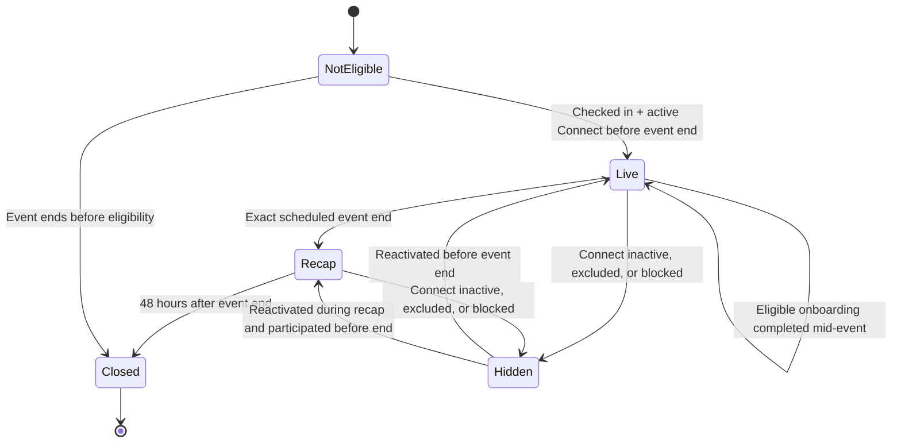

# Crush Connect Event Lobby & "People I've Met"

**Date:** 2026-07-17

**Status:** Product decisions complete; implementation not started

**Scope of this PR:** Planning only. No models, migrations, routes, templates,
JavaScript, tasks, or production behavior are changed.

**Related documents:**
[Crush Connect — Product Overview](../../products/crush-connect.md),
[Asymmetric Catalogue Transition](2026-06-09-crush-connect-catalogue-transition.md),
[Apple Wallet Tickets / Event Check-In](2026-04-07-apple-wallet-tickets-design.md)

## 1. Executive summary

Crush Connect will add a private, event-scoped lobby that turns a verified
physical event attendance into a lightweight way to recognize people, express
interest while everyone is still in the room, and mutually confirm real-world
encounters afterward.

The feature has three surfaces:

1. **Event Lobby — live:** checked-in, active Crush Connect members see only
   the profile photos of the other eligible checked-in members. Each person
   has three irrevocable, anonymous "I'd like to meet you" signals per event.
   A mutual signal reveals the two first names and prompts them to say hello in
   person; it does not create a chat or permanent connection.
2. **Who was there — 48-hour recap:** at the event's exact scheduled end, the
   live lobby closes and all eligible attendees can mark every person they
   actually met. Marks are unlimited, anonymous, and irrevocable. Only a
   mutual confirmation creates a permanent encounter.
3. **People I've Met:** a single chronological collection inside Crush
   Connect. Each entry shows only the current photo and first name and opens
   the member's full current Crush Connect profile. It never opens a chat or
   sends a contact request.

The feature is not a nearby radar, location tracker, attendee directory, or
new swipe feed. Event attendance, active Crush Connect membership, completed
onboarding, and LuxID are all required. Guests outside Crush Connect continue
to use the existing event check-in normally but never enter the lobby.

## 2. Final product decisions

These decisions are the agreed source of truth for implementation.

| Area | Decision |
|---|---|
| Event coverage | The lobby exists automatically for every published, non-cancelled Crush.lu event; there is no per-event enable switch. |
| Normal event check-in | All guests can still be checked in. The new feature must not change registration, ticket, attendance, voting, quiz, or coach-scanner behavior. |
| Feature eligibility | Only checked-in members with an active, fully onboarded, non-excluded, LuxID-backed Crush Connect membership may enter or appear. |
| Mid-event onboarding | A checked-in guest who completes Crush Connect onboarding before the scheduled event end joins immediately and receives full access. |
| Lobby roster | All eligible checked-in members see all other eligible checked-in members, regardless of dating preferences, arrival time, Premium tier, or temporal overlap. |
| Lobby identity | Before mutual interest, the grid displays the current primary profile photo only. No first name, age, event metadata, profile fields, or exact check-in time. |
| Live interest | Three outgoing signals per user per event. Each signal is private, anonymous, and irrevocable. Incoming signals are unlimited. |
| Live counter | The recipient sees the exact anonymous count, e.g. "2 people here would like to meet you." |
| Mutual live signal | Reveal photo + first name to both people and show "Say hello now." Keep the reveal accessible until event end. |
| Existing encounter | A person already in People I've Met remains visible in the live grid, but tapping shows "You've already met" and cannot consume a signal. |
| Live end | The live lobby closes at the exact scheduled end (`date_time + duration_minutes`). Coaches cannot extend it. |
| Recap window | Opens immediately at scheduled end and closes exactly 48 hours later. |
| Recap roster | Includes all members who became eligible and joined the lobby no later than scheduled end, including earlier arrivals and people who may already have left. |
| Meeting confirmations | Unlimited per event, anonymous, and irrevocable. Each confirmation requires an explicit irreversible-action dialog. |
| Recap counter | Show the exact number of anonymous incoming confirmations. Never reveal which photos generated them before mutual confirmation. |
| Live mutuals in recap | Sort them first and mark them with photo, first name, and "You wanted to meet at the event." They still require a separate mutual meeting confirmation. |
| Permanent encounter | Created only after both people independently confirm that they met. A live mutual alone is never sufficient. |
| Permanent collection | One flat chronological collection; newest first. Show only current photo and first name. Do not show the event, date, or encounter history. |
| Repeated meetings | One permanent entry per pair. Later shared events do not reorder or modify the existing entry. |
| Profile access | Tapping a permanent entry opens the full current Crush Connect profile only. No chat, contact request, or message is created. |
| Connect deactivation | Hide lobby access and all permanent encounters while inactive. Restore permanent encounters if the member reactivates. |
| Removal | The member requests removal from the encounter profile menu and supplies a reason. Hide immediately on both sides; assigned Crush Coach or Support reviews final removal. |
| Removal privacy | Never notify the other person that a removal was requested, approved, or completed. |
| Blocking | Existing block/report actions remain immediate and do not require Coach or Support approval. Blocked users are mutually invisible everywhere in this feature. |
| Notifications | MVP uses in-app notifications only. No web push, APNS, email, SMS, or system notification. |
| Navigation | No new bottom-navigation item. Show a live lobby card on the Crush Connect hub while eligible; keep People I've Met as a permanent hub section. |

## 3. Goals and non-goals

### Goals

- Reward real attendance and real conversations rather than more online
  browsing.
- Give members a safe, playful way to express interest while both are at the
  event.
- Let members build a durable record of mutually confirmed real-world
  encounters.
- Allow a checked-in guest to finish onboarding at the venue and participate
  without a second check-in.
- Preserve the trust promise: every visible person is an active, LuxID-backed
  Crush Connect member who was checked in at the same event.
- Keep all identity reveals consent-based and pairwise.

### Non-goals

- No GPS, geofence, distance, map, table, room, or movement tracking.
- No public or pre-event attendee list.
- No access for registered-but-not-checked-in guests.
- No compatibility or dating-preference filtering in the event roster.
- No automatic message thread, contact request, Spark, Coach Pick, Drop, or
  dating match.
- No event-level configuration or Coach-controlled extension.
- No paid boosts, ranking, Premium advantage, or monetization in MVP.
- No outbound push or email notifications in MVP.
- No self-service deletion of a mutually confirmed permanent encounter.

## 4. Terminology

| Product term | Meaning |
|---|---|
| Event Lobby | The protected live photo grid for one active event. |
| Lobby participant | A checked-in guest who also satisfies the current Crush Connect feature gate before the scheduled event end. |
| Meet signal | The live, anonymous, irrevocable "I'd like to meet you" action; maximum three outgoing per participant per event. |
| Live mutual | Both people sent a meet signal to each other during the live event. Identity is revealed for the in-person prompt only. |
| Meeting confirmation | The post-event, anonymous, irrevocable "Yes, we met" action. Unlimited during the recap window. |
| Confirmed encounter | Two reciprocal meeting confirmations for the same pair; the only event action that creates People I've Met. |
| People I've Met | The permanent pairwise collection of confirmed encounters. |

Internal names should avoid reusing `Connection`, `Match`, `Spark`, or
`EventRegistration` for these concepts. Those names already have different
semantics in the existing product.

## 5. Eligibility and access control

### 5.1 Active Crush Connect definition

Create one shared service/policy function for this feature. A normal member is
eligible only when all conditions are true:

1. authenticated user;
2. an `EventRegistration` for this event has `status="attended"`;
3. the event is published and not cancelled;
4. a `CrushConnectMembership` exists;
5. `onboarded_at` is non-null;
6. `excluded_by_coach` is false;
7. the Crush profile is active/approved according to the current Connect gate;
8. `CrushProfile.has_luxid_connected` is true;
9. the member satisfies the current clear-photo consent requirement and has a
   usable primary photo;
10. the member is not blocked from Crush Connect by launch-phase policy.

Premium and an assigned Coach are not required. Dating preferences are never
part of this event-lobby gate.

Because the current `photo_share_consent` copy describes curated Connect cards,
implementation must version/extend the Crush Connect consent so it explicitly
covers clear-photo sharing with checked-in members in an Event Lobby. Existing
members acknowledge the updated Connect consent once before their first lobby;
there is no separate per-event opt-out. Until acknowledgement they behave like
an incomplete member: event check-in still succeeds, but no lobby participation
or roster access is created.

Staff preview must not implicitly expose a real event roster. Any staff-only
preview should use synthetic fixtures or require an explicit debug path.

### 5.2 Symmetric visibility

A member can see another participant only if:

- both have lobby participation for the same event;
- the current surface is inside its allowed phase;
- both remain active Crush Connect members;
- neither user has blocked the other;
- neither user's permanent encounter with the other is pending removal or
  removed when rendering People I've Met.

Loss of eligibility takes effect at read/render time, not only when records
are created. A stale browser session must not preserve roster access.

### 5.3 Non-Connect and not-yet-onboarded guests

- The existing event check-in succeeds exactly as it does today.
- They do not appear in lobby participant counts, rosters, broadcasts, or
  notifications.
- They cannot infer whether a lobby exists or who is in it.
- A checked-in, LuxID-capable guest who is not onboarded sees an onboarding CTA
  instead of the lobby.
- If onboarding finishes before scheduled event end, create participation
  idempotently, publish "Someone new joined the event lobby", and grant three
  meet signals.
- Finishing onboarding after the exact event end does not retroactively grant
  access to that event's recap.

## 6. Time and state model

Derived timestamps:

- `event_end_at = event.date_time + event.duration_minutes`
- live access starts independently for each participant when eligible
  participation is created;
- `recap_opens_at = event_end_at`;
- `recap_closes_at = event_end_at + 48 hours`;
- an in-app recap reminder becomes eligible at `event_end_at + 24 hours` if
  the member has not completed any recap action.

All POST endpoints must compare server time with these derived values inside
the same transaction as the write. The browser countdown is informative only.

The phase should normally be derived rather than stored, preventing delayed
tasks from leaving a lobby open. Background tasks are only for idempotent
notifications and cleanup.

## 7. User experience

### 7.1 Check-in and entry

The current signed QR/Coach check-in remains authoritative. After a successful
transition from `confirmed` to `attended`, an event-lobby service evaluates the
guest without delaying or failing the check-in response.

Eligible member:

- create lobby participation idempotently;
- broadcast a sanitized participant-added event;
- show the live card on the Crush Connect hub;
- open the lobby from that card.

Not-yet-onboarded but potentially eligible member:

- show "Finish Crush Connect to join the Event Lobby" on the hub;
- return to the active lobby automatically after successful onboarding;
- do not expose the roster during onboarding.

Non-Connect member:

- sees no lobby card, participant count, teaser count, or locked roster;
- continues using all normal event functionality.

### 7.2 Live lobby

The main surface is a responsive photo-button grid.

Each ordinary tile contains only:

- the member's current primary photo;
- a non-identifying accessible action label;
- a temporary visual "New" treatment when the client learned of the join.

It must not contain the name in HTML, alt text, tooltip, data attributes, URL,
analytics payload, or client-visible JSON before a mutual reveal. The photo
serving endpoint must authorize the requesting viewer against the event roster
rather than relying on an unguessable URL.

Self is excluded. All other eligible participants appear. Default order is
stable by lobby join time, newest first, so a "Someone new joined" banner has
a predictable destination. Do not rank by received signals.

Header state:

- event title;
- countdown to exact scheduled end;
- "N of 3 signals left";
- exact incoming anonymous signal count;
- a concise privacy explanation.

### 7.3 Sending a live meet signal

1. Member taps a photo.
2. If the pair already has a permanent encounter, show "You've already met"
   and stop.
3. Otherwise show an irreversible confirmation dialog.
4. On confirmation, create one directional signal transactionally.
5. Consume one of the sender's three event attempts permanently.
6. If no reverse signal exists, show a neutral sent state; recipient's exact
   anonymous count increments.
7. If the reverse signal exists, create/reveal the live mutual atomically.

Signals cannot be undone, transferred, regenerated by re-check-in, or reset by
temporary Connect deactivation. Duplicate taps must be idempotent and must not
consume additional attempts.

### 7.4 Receiving and resolving live signals

The recipient sees only an in-app banner and exact count:

> "2 people here would like to meet you."

No sender identifier or candidate subset is disclosed. The recipient uses the
same three irreversible signals to express genuine interest, not a separate
free guessing mechanism.

On mutual signal:

- reveal the other member's photo and first name to both people;
- show "You and {first_name} would like to meet. Say hello now.";
- place the pair in a retrievable "Say hello" area until the event ends;
- do not open a chat, create a Spark, notify a Coach, or create People I've
  Met.

### 7.5 In-app arrival updates

When a newly checked-in active member joins:

> "Someone new arrived."

When an already checked-in guest completes onboarding:

> "Someone new joined the Event Lobby."

The notification reveals no identity. Tapping opens the lobby and temporarily
highlights the newest tile. Several joins in a short interval may be coalesced
into "3 new people joined" to avoid an entrance-time banner flood. This is an
in-app realtime banner, not a system push.

### 7.6 Exact event end

At `event_end_at`:

- reject all new meet signals server-side;
- close live WebSocket membership;
- remove the hub's live-lobby state;
- open the 48-hour recap;
- generate one persisted in-app notification: "Who did you meet? You have 48
  hours.";
- preserve live mutuals only as recap highlighting, not as encounters.

No Coach override or grace period applies.

### 7.7 48-hour recap

The recap is another protected photo grid containing every eligible lobby
participant from the event, regardless of arrival time. Self and blocked users
are excluded.

Display rules:

- reciprocal live-signal people sort first;
- for those people only, keep photo + first name visible and label "You wanted
  to meet at the event";
- all other unconfirmed people show photo only;
- previously confirmed permanent encounters are non-actionable and show
  "You've already met" when tapped;
- show the exact aggregate count of anonymous incoming meeting confirmations.

Meeting confirmation flow:

1. tap a photo;
2. choose "Yes, we met";
3. confirm "Are you sure? This cannot be undone.";
4. create one immutable directional confirmation;
5. if the reverse confirmation exists, create the permanent encounter
   idempotently;
6. reveal the first name and show "{first_name} was added to People I've
   Met.".

The sender cannot withdraw a one-sided confirmation. The recipient never sees
which participant confirmed them unless they independently confirm the same
person. At recap close, no more confirmations are accepted.

### 7.8 People I've Met

The Crush Connect hub contains a permanent section that opens one flat,
chronological collection.

Collection rules:

- one entry per unordered pair of users;
- newest newly created encounter first;
- repeated shared events never update the encounter timestamp or ordering;
- card shows current primary photo and current first name only;
- no event title, event date, counter, badge, or meeting history;
- tap opens the member's full current Crush Connect profile;
- no message, chat, connection request, Spark, or Coach workflow;
- entries disappear while either side is inactive/excluded or the pair is
  blocked;
- ordinary reactivation restores existing entries;
- approved removal is permanent and is never undone by reactivation.

## 8. Removal, blocking, and safety

### 8.1 Encounter removal request

The full profile reached from People I've Met includes an overflow action:
"Request removal".

1. Requester selects a reason and may add concise private details.
2. Submission immediately changes the connection to hidden for both people.
3. The assigned Crush Coach, when available, or authorized Support staff
   receives a review item.
4. Reviewer approves permanent removal or resolves the case according to the
   moderation policy.
5. The other person receives no notification and never sees the reason.
6. The requester may receive a private status update; rejection must never
   automatically re-expose the profile without an explicit moderator action.

The reason, requester, reviewer, timestamps, and outcome form an internal audit
record. They are not user-profile data.

### 8.2 Blocking and reporting

Blocking and reporting remain self-service and immediate. They must not wait
for the removal-review workflow.

On block:

- remove both people from each other's live and recap payloads;
- exclude existing anonymous counts attributable to the blocked pair;
- prevent new signals and confirmations;
- hide any People I've Met entry;
- keep only the moderation/audit data required by existing policy.

Unblocking does not revive expired event windows or removed encounters.

## 9. Proposed domain model

Names are proposals; implementation may refine them while preserving the
invariants.

### 9.1 `EventLobbyParticipation`

One row per eligible `EventRegistration` that joined before scheduled end.

Proposed fields:

- `event_registration` — one-to-one, authoritative attendance link;
- `event`, `user` — indexed denormalized foreign keys for safe queries;
- `joined_at` — first eligible lobby time, immutable;
- `eligibility_source` — `checkin` or `onboarding_completed` for audit;
- `created_at`.

Constraints:

- unique `(event, user)`;
- user must match the registration user;
- registration must belong to the event;
- created only before exact event end;
- never created for non-Connect attendees.

This row freezes recap membership while all current access checks remain
dynamic. It must not snapshot the person's photo, name, preferences, or profile
details.

### 9.2 `EventMeetSignal`

One immutable directional live interest per event pair.

Proposed fields:

- `event`, `sender`, `recipient`, `created_at`;
- optional `mutual_revealed_at` for audit/idempotent UX.

Constraints:

- unique `(event, sender, recipient)`;
- `sender != recipient`;
- both users have lobby participation;
- maximum three distinct recipients per `(event, sender)`, enforced inside a
  locking transaction/service rather than only in the UI;
- writes allowed only before exact event end.

### 9.3 `EventMeetingConfirmation`

One immutable directional post-event assertion.

Proposed fields:

- `event`, `confirmer`, `other_user`, `created_at`.

Constraints:

- unique `(event, confirmer, other_user)`;
- `confirmer != other_user`;
- both users have lobby participation;
- writes allowed only during the 48-hour recap;
- no per-user quota.

### 9.4 `ConfirmedEncounter`

One durable unordered pair for People I've Met.

Proposed fields:

- canonical `user_low`, `user_high` ordering;
- `created_from_event` — internal audit FK, never rendered in the collection;
- `created_at` — set once and never touched by later shared events;
- `status` — `active`, `removal_pending`, or `removed`;
- `hidden_at`, `removed_at` as appropriate.

Constraints:

- unique `(user_low, user_high)`;
- canonical ordering and no self-pair;
- creation service requires reciprocal confirmations for the same event;
- repeated mutual confirmations return the existing row unchanged.

### 9.5 `ConfirmedEncounterRemovalRequest`

Proposed fields:

- `encounter`, `requested_by`;
- structured `reason`, optional private `details`;
- `status`, `requested_at`, `reviewed_at`;
- assigned `reviewed_by_coach` or authorized staff actor;
- private `resolution_notes`.

Submitting sets the parent encounter to `removal_pending` in the same
transaction. The other member never receives a notification.

## 10. Services and integration boundaries

Keep business rules out of templates, consumers, and the check-in endpoint.
Introduce a feature service layer with idempotent operations such as:

- evaluate/create lobby participation after attendance or onboarding;
- list authorized live/recap participants with server-side identity shaping;
- send an irreversible meet signal with quota locking;
- detect/reveal a live mutual;
- confirm an encounter and create a permanent pair;
- list People I've Met with current eligibility and blocking filters;
- submit and review removal requests;
- calculate phase/timestamps from the event;
- build anonymous counters without leaking sender identities.

Integration points:

1. `views_checkin.event_checkin_api` calls the participation service only
   after attendance commits successfully. A lobby failure must be logged and
   retried but must not roll back a valid event check-in.
2. Crush Connect onboarding completion calls the same idempotent service for
   any currently attended, not-yet-ended event.
3. Connect exclusion/deactivation and existing blocking are rechecked on every
   list/write operation; optional broadcasts prompt open clients to refetch.
4. Hub context uses a single query/service for active lobby and recap cards.
5. Django Tasks schedules only the persisted recap/reminder notification and
   cleanup. Every task is idempotent because production uses the DB task
   backend while development/tests use the immediate backend.

## 11. HTTP and realtime contract outline

Exact route names are deferred to implementation, but the surface needs:

| Operation | Phase | Response identity |
|---|---|---|
| Get current event-lobby state | Live/recap | Phase, countdown, own quotas/counters; no unauthorized roster identity. |
| List live participants | Live | Opaque participant handle + authorized photo URL/state only. |
| Send meet signal | Live | Own remaining quota and neutral/mutual result. |
| List recap participants | Recap | Photo-only by default; first name only for authorized reveals. |
| Confirm meeting | Recap | Neutral or newly mutual result. |
| List People I've Met | Any active Connect state | Photo, first name, and authorized profile link only. |
| Request encounter removal | Any active encounter | Private request status only. |

All mutations are authenticated POST endpoints with CSRF protection. Never put
sender identity, user IDs, first names, or signal source in client-visible
anonymous-count responses.

### 11.1 Separate member WebSocket

The existing `CheckinConsumer` is Coach-only and forwards attendee names and
profile data. It must remain unchanged and must not be shared with members.

Add a distinct Event Lobby consumer with:

- authentication plus event registration and active-Connect authorization on
  connect;
- authorization recheck for every received action or, preferably, a read-only
  consumer with all writes over HTTP;
- sanitized event-wide messages that make clients refetch (`participant_joined`,
  `phase_changed`);
- private per-user messages for counter changes and mutual reveal;
- no anonymous sender identity in broadcast payloads;
- disconnect/denial at event end or eligibility loss;
- polling/refetch fallback when WebSockets or Redis are unavailable locally.

The server is authoritative; broadcasts are hints, never the source of roster
or quota truth.

## 12. In-app notification plan

MVP writes/shows only in-app notifications. It must explicitly bypass push and
email dispatch even if a member has those channels enabled.

| Trigger | Persistence | Copy shape |
|---|---|---|
| Participant joins live lobby | Ephemeral banner, coalescible | "Someone new arrived" / "3 new people joined" |
| Mid-event onboarding joins lobby | Ephemeral banner | "Someone new joined the Event Lobby" |
| Incoming live signal | Ephemeral banner + live exact counter | "2 people here would like to meet you" |
| Live mutual | Persist until event end in lobby UI | "You and {first_name} would like to meet. Say hello now." |
| Recap opens | Persisted in-app notification | "Who did you meet? You have 48 hours." |
| 24-hour recap reminder | Persisted, idempotent, only when useful | "Your event recap closes in 24 hours." |
| Incoming meeting confirmation | Recap exact counter | "3 people from the event believe you met." |
| Confirmed encounter | Persisted in-app notification | "{first_name} was added to People I've Met." |
| Removal request/result | Private requester notification only | Never notify the other member. |

All copy requires EN/DE/FR translation before launch.

## 13. Privacy, data retention, and security invariants

- Event and profile photos are served only after an authorization check; do
  not expose public blob URLs for this surface.
- Pre-mutual APIs use opaque event-scoped handles, not durable user IDs.
- First name is withheld everywhere until the exact pair has an authorized
  mutual reveal or permanent encounter.
- The roster is never embedded in a page available before eligibility checks.
- Browser caches for roster/photo responses must be private/no-store where
  practical.
- Do not include anonymous sender identity in logs, analytics events, URL
  paths, DOM attributes, or error messages visible to clients.
- Rate-limit signal and confirmation endpoints in addition to database
  uniqueness/quota constraints.
- Use row locks and idempotency to prevent simultaneous requests from exceeding
  three signals or creating duplicate encounters.
- Expired one-sided signals, directional meeting confirmations, and lobby
  participation rows are no longer user-visible after recap close. Retain them
  for at most 30 days after recap close for abuse/support investigation, then
  hard-delete them. A record attached to an active safety report follows the
  existing moderation/legal-hold policy instead.
- Once the 30-day cleanup runs, a permanent encounter keeps only its own
  minimal provenance reference; it does not preserve or expose the expired
  anonymous interaction records.
- Keep only the minimum event reference needed to prove creation of a permanent
  encounter; never render it to members.
- Safety reports and removal audits follow the existing moderation retention
  policy rather than the short-lived lobby retention.

## 14. Accessibility and responsive behavior

- Every photo tile is a keyboard-operable button with visible focus state.
- Before reveal, accessible names must remain generic (for example, "Select
  participant photo") and must not leak the first name to assistive technology
  when sighted users cannot see it.
- After a mutual reveal, announce the first name and "Say hello now" through an
  ARIA live region.
- Exact counters use text as well as icons; never rely on color or emoji alone.
- Irreversible dialogs identify the action, consequence, and remaining quota.
- Grid, dialogs, counters, and pinned live mutuals must work at narrow PWA/iOS
  widths and in light/dark themes.
- Use the existing CSP-compatible Alpine registration/mixin conventions and
  canonical Crush design tokens during implementation.

The photo-only product decision creates an inherent accessibility limitation
for members who cannot identify a person visually. Design review must test the
flow with assistive-technology users without silently revealing identities
that remain hidden for everyone else.

## 15. Analytics

Use aggregate, event-scoped analytics. Do not record which person was selected
in the product analytics pipeline.

Suggested events/metrics:

- eligible check-ins and mid-event onboarding joins;
- lobby opens / eligible participants;
- meet signals sent per participant and quota exhaustion;
- mutual live-signal rate;
- recap opens and completion rate;
- meeting confirmations and mutual-confirmation rate;
- confirmed encounters created;
- removal requests and blocks per 1,000 participants;
- WebSocket fallback/error rate.

Small-event dashboards must use minimum cohort thresholds. Coaches and venue
partners receive no individual-level signal or confirmation data.

## 16. Failure and edge-case behavior

| Case | Required behavior |
|---|---|
| Duplicate/scanned QR again | Attendance remains idempotent; no new participation, signal reset, or duplicate notification. |
| Check-in occurs after scheduled end | Normal existing check-in policy applies, but no lobby participation or recap access is created. |
| Event cancelled | No lobby/recap access; reject writes and close realtime channels. |
| Member finishes onboarding mid-event | Join once, broadcast neutral join, grant exactly three signals. |
| Member deactivates and reactivates during same event | Existing participation/signals remain; quota never resets. Access returns only if the phase is still valid. |
| Member deactivates after permanent encounters | Collection hides; ordinary reactivation restores it. |
| User changes photo/name | Authorized surfaces render the current profile values; no event snapshot is exposed. |
| Two signals arrive simultaneously | One transactional mutual reveal, no duplicates. |
| Fourth signal races from two tabs | Server accepts at most three total. |
| Two meeting confirmations arrive simultaneously | One permanent encounter and one notification per recipient. |
| Pair already has permanent encounter | Tile remains visible but is non-actionable; no live/recap attempt is consumed. |
| Pair blocks during event | Both disappear from each other's current and future payloads immediately. |
| Recap closes while dialog is open | Server rejects submission; UI refreshes to closed state. |
| Redis/WebSocket unavailable | Authorized polling/refetch preserves correctness; realtime banners may be delayed. |
| Lobby side effect fails after check-in | Check-in stays successful; retry participation idempotently. |

## 17. Delivery plan

### Phase A — foundation and policy

- Add the proposed models, constraints, migrations, admin read views, and
  feature service/policy module.
- Add phase calculation, eligibility, blocking, current-photo authorization,
  and opaque participant handles.
- Add unit tests for all invariants before UI work.
- Introduce a global rollout flag; it controls launch but never becomes a
  per-event switch.

### Phase B — live lobby

- Integrate successful check-in and onboarding completion.
- Add protected live-state/list/signal endpoints.
- Add the member-only Event Lobby consumer and polling fallback.
- Add hub card, photo grid, counters, irreversible signal flow, neutral join
  banners, mutual reveal, and "Say hello" area.

### Phase C — recap and permanent encounters

- Add exact event-end transition behavior and 48-hour recap endpoints.
- Add unlimited irreversible meeting confirmations and anonymous counters.
- Add live-mutual recap highlighting and transactional permanent encounter
  creation.
- Add People I've Met collection and full-profile authorization.

### Phase D — safety and operations

- Add removal-request UX and Coach/Support review queue.
- Verify immediate blocking/reporting across every query and realtime path.
- Add privacy cleanup task and moderation audit handling.
- Add aggregate analytics with small-cohort protection.

### Phase E — launch readiness

- Complete EN/DE/FR copy and translations.
- Perform accessibility, mobile/PWA, light/dark, concurrency, privacy, and
  abuse reviews.
- Update `docs/products/crush-connect.md`: add the new product surfaces and
  remove the now-stale ban on "people you've met at events" only when the
  feature is actually implemented and enabled.
- Run a closed test with one synthetic event, then one real Crush.lu event
  behind the global rollout flag.

## 18. Test plan for implementation PRs

### Model/service tests

- every eligibility condition independently denies access;
- non-Connect check-in succeeds without participation;
- onboarding before end joins; onboarding after end does not;
- late eligible attendee sees all earlier eligible participants;
- dating preferences and Premium tier do not filter roster;
- exact three-signal quota under concurrency and duplicate requests;
- signals/confirmations are immutable;
- anonymous counters exclude blocked/ineligible senders;
- reciprocal signal reveals only the exact pair;
- reciprocal confirmations create one permanent encounter;
- repeated events do not reorder/update a permanent encounter;
- event phase boundaries use exact server timestamps;
- deactivation hides and reactivation restores;
- removal pending hides immediately and never notifies the other member.

### HTTP authorization tests

- guest, registered-only, confirmed-but-not-attended, non-Connect, incomplete,
  non-LuxID, excluded, blocked, and expired-recap requests are denied;
- participant A cannot fetch participant data for another event;
- opaque handles cannot be replayed across events;
- pre-mutual responses contain no first name/user ID leaks;
- CSRF, method, object ownership, and rate-limit behavior.

### WebSocket tests

- Coach `CheckinConsumer` behavior remains unchanged;
- member consumer rejects every ineligible state;
- event broadcasts are sanitized;
- private counter/mutual events reach only the intended user;
- access closes at event end and after eligibility loss;
- reconnect/refetch restores authoritative state without duplicate banners.

### End-to-end flows

1. two active members check in, see photo-only tiles, signal mutually, and see
   first names plus "Say hello";
2. one non-Connect attendee checks in successfully but sees/appears nowhere;
3. one checked-in guest completes onboarding on site and joins live;
4. event ends exactly, signal endpoint closes, recap opens;
5. two people separately confirm, receive one permanent encounter, and see
   photo + first name in People I've Met;
6. a one-sided confirmation stays anonymous and disappears from UI after
   recap close;
7. removal request hides both sides immediately and Support resolves without
   notifying the other user;
8. block during live and recap removes both people immediately.

## 19. Acceptance criteria

The feature is launchable only when all of the following are true:

- A non-checked-in or inactive/non-LuxID/non-onboarded user cannot access or
  infer any lobby participant data.
- A normal event check-in never depends on the lobby succeeding.
- All eligible attendees see all other eligible attendees, with photo only
  until an authorized reveal.
- The server enforces exactly three immutable live signals per event.
- Anonymous counters are exact but never identify a sender.
- A live mutual reveals first names and prompts an in-person hello without
  creating a permanent connection.
- The live phase closes at exact scheduled end and the recap closes exactly 48
  hours later.
- Only reciprocal, immutable post-event confirmations create People I've Met.
- The permanent collection contains only photo and first name, remains one
  entry per pair, and never reorders on later meetings.
- No automatic chat, message, Spark, connection request, or Coach matching
  action is created.
- Removal requires Coach/Support review, hides immediately, and never notifies
  the other member.
- Existing blocks, exclusions, event check-in, quiz, voting, and Coach scanner
  behavior remain intact.
- MVP emits no push, email, APNS, or SMS notification.

## 20. Explicitly deferred decisions

These items are intentionally outside MVP and require a later product decision:

- system push notifications;
- venue/partner benefits or monetization;
- event-specific enable/disable controls;
- Coach lobby moderation controls;
- chat or contact-request actions from People I've Met;
- compatibility filters;
- geolocation or non-event hotspots;
- retention beyond the defined 30-day maximum for expired anonymous records.
